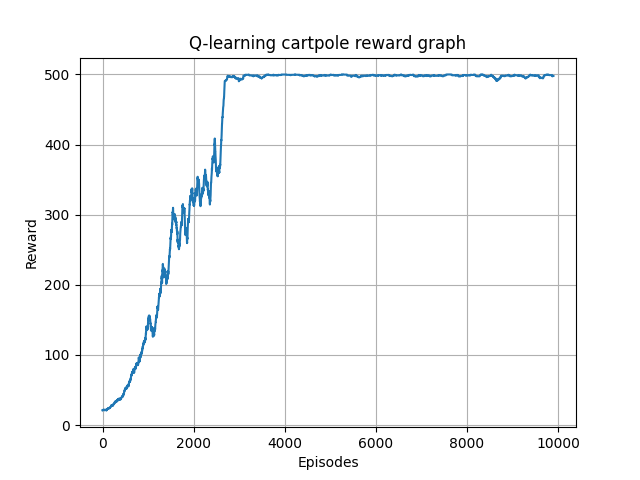
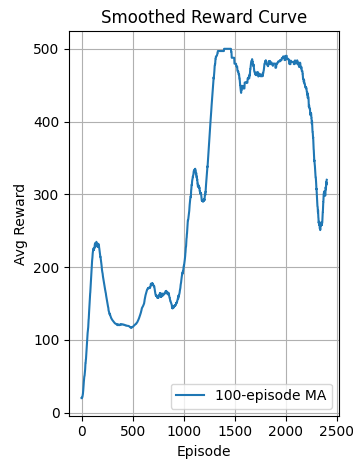

# Q-Learning on CartPole-v1


This project implements two methods of Q-learning, **deep Q-learning (DQN)** and **tabular Q-learning** to solve the classic control problem [CartPole-v1](https://www.gymlibrary.dev/environments/classic_control/cart_pole/).

**Tabular Q-learning** is performed using **state discretization**, epsilon-greedy exploration, alpha-decay, & Bellman updates to ensure that on every run, it produces an agent that consistently scores nearly 500 reward on every run.

Despite the continuous state space, Q-learning is made effective by discretizing the observation features into fixed bins and learning Q-values per discrete state–action pair.

10 bins are selected for the cart position, cart velocity, and pole velocity features, while 20 bins are selected for the pole angle feature since it is the most sensitive to small changes.

**Deep Q-learning (DQN)** is performed using a neural network with 2 hidden layers, each with 128 neurons, followed by an output layer, with one value per action. Instability is addressed by using double Q-learning, which makes training more reliable and helps mitigate sudden drops in performance.

A replay buffer of size 200,000 is used alongside random sampling to help ensure reliable, stable updates to the model. Gradient clipping is also used to prevent wild swings and maintain numerical stability.

---

## Goal

Balance a pole vertically on a moving cart for as long as possible.  
Each timestep the pole remains upright earns a reward of `+1`.  
Episodes terminate when:
- The pole angle exceeds `+/- 12°`.
- The cart moves too far from center
- The episode reaches 500 steps (At which point the agent has 'solved' the episode)

---

## Key Concepts

 - **Q-Learning**      : Off-policy reinforcement learning algorithm that updates a Q-table using TD learning.
 - **Discretization**  : Continuous states (cart position, velocity, etc.) are mapped to discrete bins so Q-values can be indexed in a table. This is done using the discretizer class.
 - **ε-Greedy Policy** : With probability ε, take a random action. With probability 1−ε, take the best known action. 
 - **Bellman Update**  : Core learning rule: `Q[s][a] ← Q[s][a] + α (r + γ·max Q[s'] - Q[s][a])` (This is the Bellman equation)
 - **Deep Q Learning (DQN)**             : Uses a neural network to predict Q values corresponding to actions, rather than discretized states. This helps mitigate issues with large state spaces, and can provide improved performance.
 - **Double DQN**      : Two models, A and B, are used. Model A selects what it thinks the best action in the next state is, while model B evaluates model A's Q-value. This decouples selection and evaluation, reducing overestimation bias and increasing stability.
---

## Hyperparameters

For Cart Pole Tabular:

```python

alpha, alpha_min, alpha_decay = 0.3, 0.005, 0.999 # learning rate, how much do we update Q(S,A) each time. What to multiply the learning rate by each time. Min value for learning rate.
gamma = 0.99 # discount factor for future rewards, if gamma = 1 we have instability in stochastic environments, but gamma should be near 1 because we care about future rewards too
epsilon, epsilon_min, epsilon_decay = 1.0, 0.01, 0.999 # the chance we take a random action to explore (exploration vs exploitation). The min value for epsilon (can't go below this). What to multiply epsilon by after each simulation
episodes = 10000 # number of simulations to run where it will learn
max_steps = 500 # max length of simulation, if we haven't failed by t=500 we've 'solved' it.

```

For Cart Pole w/ DQN:
```python

buffer_size = 200000
batch_size = 256
gamma = 0.99 # 1 leads to stochastic instability
alpha, alpha_decay, alpha_min = 0.0001, 1, 0
target_update_freq = 10 # number of steps we take between theta_target <- theta
epsilon, epsilon_min, epsilon_decay = 1, 0.01, 0.992 
episodes = 2500
max_steps = 500 

```

## Results

For tabularized Q-learning, after ~2,500 - 4,500 episodes, the agent consistently achieves average rewards near 500 (at least 495).
For Deep Q-learning, after ~ 1,100 - 1,300 episodes, the agent consistently achieves average scores near 500. However, the agent may exhibit brief instability after convergence due to continued ε-greedy exploration and learning updates.

Reward curve image for Tabularized Q-learning agent:


Reward curve image for Deep Q-learning agent:


## Files

 - CartPoleTabularized.py: Main training loop for tabularized Q-learning.
 - discretizer.py: Discretizer class that maps the continuous space to discrete subspaces.
 - requirements.txt: The requirements needed to run it.
 - replay_buffer.py: This is the class that stores the replay buffer data structure used in DQN.
 - dqn_agent.py: This class contains the PyTorch implementation of the DQN agent's architecture.
 - CartPoleDQN.py: Main training loop for DQN, uses double DQN.
 - dqn_cartpole_solved.pth: The stored data about the agent that performed best in DQN.
 - README.md: You're in the readme right now! This is the project description.
 - assets: Contains the image assets used for the reward curves in this README.

## How to run

```bash
pip install -r requirements.txt
python CartPoleTabularized.py
python CartPoleDQN.py
```

## Credits

Built by Micah Tracht. Inspired by OpenAI Gym's classic control suite (thanks the Gym library, I used it a lot, and it was really easy to learn!) and Sutton & Barto's RL textbook (Again, thanks, it's been an amazing resource for me!) Also have to give credit for PyTorch, I can't code this stuff from scratch (yet), so thanks for making such an accessible and easy to use library!
